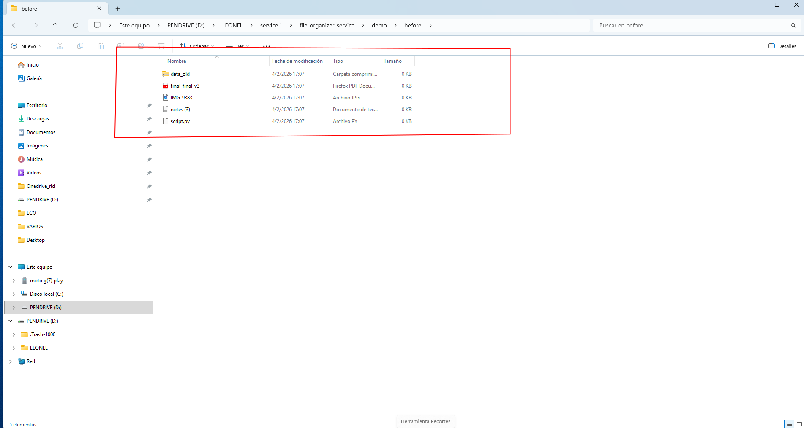

# ⚙️ File Organization Automation (Python)

> Automatically organize messy folders into clean structures (Docs, Images, Code, Archives, Others).

This small Python tool lets you take any messy folder and instantly sort it into organized subfolders by file type.

---

## ▶️ Run

```bash
python auto_organize.py "demo_before" "demo_after" --mode copy
```

- `--mode copy` keeps the original files
- `--mode move` moves files into the organized folders

---

## 📁 Result

### Before


### After


---

## 🧩 What this is useful for

- Messy Downloads folders
- Project folders full of mixed files
- Repetitive manual sorting
- Preparing folders for sharing or archiving

---

## ⚙️ Requirements

Python 3.8+

---

## License

MIT License. See `LICENSE`.
